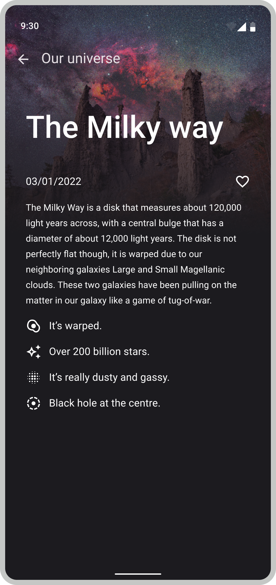

# Adyen Android Assignment

## Overview
This repository contains the coding challenge for Android developer candidates at Adyen. 
The task is to create an app using NASA's Astronomy Picture Of the Day (APOD) API.

## Setup
1. Register for an [API key](https://api.nasa.gov/).
2. Add your API key to `app/local.gradle` (see `local.gradle.example` for details).
3. Verify your API key by running `PlanetaryServiceTest`.
4. Create a local Git repository.

## Time Limit
We expect you to take around 4 hours to complete the assignment.
It doesn't need to be done in one sitting, but try to use the time limit to guide your decisions.

*It will not be feasible to complete all of the features/tasks, prioritize what to work on!*

## Features
1. APOD List Screen:

         
- Create a list of APODs (images only, no videos)
- Implement ordering
  * By title (ascending)
  * By date (descending)
2. APOD Details Screen:

    
- Show detailed information about a single APOD
3. Error Handling:

    
- Implement error screens (e.g., API errors)

## Resources
- Color schemes and icons are available in the resources folder
- Screen mockups are provided in the `screens` folder

## Evaluation Criteria
We will assess:
* Feature functionality and user experience
  - Portrait and landscape orientations
  - API call optimizations
  - Adherence to provided designs
* Architecture & Code style
* Test coverage and quality
* Rationale / prioritization behind implementation decisions

## Submission
Include your Git repository (with history intact) in the final zip file.

## Prioritization
Please provide a summary of your decision-making process while working on this assignment:

The top priority in the completion of this assignment was to laid a good foundation in terms of app architecture. Within this architecture the focus was on the following areas

#### Model-View-ViewModel 
* Leveraging Jetpack's Architecture Components, a ViewModel was used to separate the view logic (i.e. user interface rendering and user interactions) from the business logic and from the network and caching layer logic and related models. 
* The ViewModel receives requests from the View and makes decisions on the correct UI state and preparing and emitting any data required to fullfill a given UI state. In order to define the various states that must be fulfill by the View, a `AstronomyPhotosListUiState` sealed class was defined.
* The repository pattern was used to abstract away network concerns (i.e. API calls made via the `PlanetaryService`). This offers maintainability such that future changes to the networking or caching layers limit or minimize the impact of changes to the ViewModel. This abstraction also improves testability, as we can write unit tests for networking and caching in isolation without being couplied to the View or ViewModel.

#### Dependency Injection
* Dependency injection was implemented using the Hilt library. 
* One of the main benefits of this pattern is improved testability since dependencies are decoupled from the class-under-test's implementation details. These dependencies can be mocked or stub, allowing for easier setup of tests without relying on complex business logic such as reading databases or making network calls.\
* Particularly with the use of dependencies that implement interfaces, using dependency injection helps with maintainability and modularity since we can swap different implementations of an interface (i.e. dependency) without having to make changes to the consuming class.

#### Networking and Caching
* For the purposes and time constraints of this assignment, the implementation of the `PlanetsRepository` interface focused on the networking calls. The `PlanetsPhotosRepository` class uses the `PlanetaryService` as a dependency, makes the required networking calls and performs any required data validation. In this case, that meant filtering any `AstronomyPicture` instances that had a `null` or empty image url.
* Furthermore, in order to abstract away the network models, Retrofit's `Response` object is validated by checking the `isSuccessful` flag and determine if the network call was successful or not. The consumers of the repository should not be concern with checking for valid data or inspecting various response codes. A `Result<T>` class was created and used as the return type so that our consumer (i.e. the ViewModel) can more easily determine if the repository was successful or not in retriving the data. Due to time constraints, the error result simply contains a `String` message. In production applications we would want to implement a seal class with more granular error responses based on the various error codes returned by the service (i.e. 500, 401, etc).
* Due to time constraints the repository did not implement a database cache. For demonstration purposes, it simply uses a in-memory copy (via private property) to determine if we already have data in memory such that we can avoid unnecessary networking calls. In a production setting, we would want to store the network data in the database and using some polling/stale tracking of the time frame between potential network calls to determine if we should refresh the data (and update the cache) or simply return the cache data.

#### UI
* For the UI implementation this project makes use of Jetpack Compose as it makes building user interfaces a lot simpler, due to its more concise and easier to read codce which ultimately helps with maintainability.
* Given the designs only show a dark-mode style of interface, this project leveraged dark-mode supports. The `AdyenTheme` implements both light and dark modes, but it is currently set to used only dark mode.
* Due to time constraints there were some UI details that were not implemented to its full potential. 
	* Unit tests should be written for the core Composables that have more elaborate lgoic. 
	* There were some screens that were not implemented, particularly the detail sceen that should be shown when the user taps on a given photo item on the main screen.
	* Some UI polishing of the main screen was missed. For example, when we are refreshing or reordering the data and the user already has data on the screen, not only are we hiding the rendered data from the user, but we are also hiding the "app bar" from the screen. 
	* All the colors were not matched to the full specifications of the designs. Particularly the use of a darker tone of purple instead of the current light purple (or pink).
	* A few other small items could be improved or fixed in the UI with more alotted time.
	
#### Testing
* Unit tests were written for our repository. Of primary interest was adding test cases for the core networking scenarios: success with data, success with no data, success with some invalid data (i.e. missing or null photo url) and error case.
* Due to time constraints, unit tests for the ViewModel were not implemented. However, placeholder functions were added in the `AstronomyPhotosViewModelTest` class to show the thought process of what should be tested in this class.
